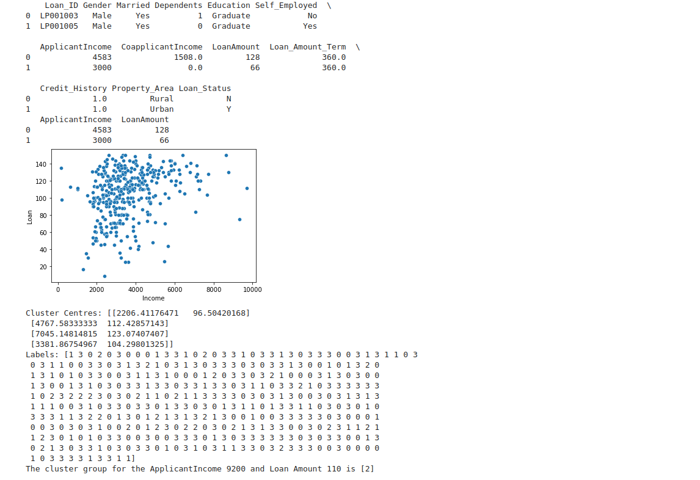

# Implementation of K-Means Clustering Algorithm
## Aim
To write a python program to implement K-Means Clustering Algorithm.
## Equipment’s required:
1.	Hardware – PCs
2.	Anaconda – Python 3.7 Installation

## Algorithm:

### Step1
<br>Import the necessary packages.

### Step2
<br>Read the csv file.

### Step3
<br>Scatter plot the applicant income and loan amount.

### Step4
<br>Obtain the kmean clustring for 2 classes.

### Step5
<br>Pretict the cluster group of Applicant Income and Loanamount.

## Program:
```python
#developed by:vinushcv
#regnumber:22001897
import pandas as pd
import matplotlib.pyplot as plt
from sklearn.cluster import KMeans
import seaborn as sns
import warnings
warnings.filterwarnings("ignore")
data=pd.read_csv("clustering.csv")
print(data.head(2))
x1=data.loc[:,['ApplicantIncome','LoanAmount']]
print(x1.head(2))
x=x1.values
sns.scatterplot(x[:,0],x[:,1])
plt.xlabel('Income')
plt.ylabel('Loan')
plt.show()
kmean=KMeans(n_clusters=4)
kmean.fit(x)
print("Cluster Centres:",kmean.cluster_centers_)
print('Labels:',kmean.labels_)
predicted_cluster=kmean.predict([[9200,110]])
print("The cluster group for the ApplicantIncome 9200 and Loan Amount 110 is",predicted_cluster)


```
## Output:



## Result
Thus the K-means clustering algorithm is implemented and predicted the cluster class using python program.
